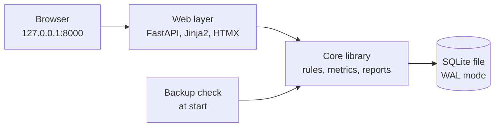

# Spending Tracker: MVP Build Specification

Date: 29 September 2026. Author: Demi.

This document replaces the earlier build specification for the first build. MVP means minimum viable product. The MVP drops the Telegram bot and the text parser. The owner enters all data in a local web app with form fields.

## 1. Overview and goals

Spendtrack is a single-user expense tracker that runs on the owner's laptop. The owner enters each expense in a local web app with structured input fields. The app exists to help the owner cut spending after a drop in income.

All data lives in one SQLite file on the laptop. The currency is RON (Romanian leu).

Every expense can carry a necessity level and a cheaper-alternative flag. Reports use these flags to show where the owner can cut spending, not only where the money went.

Goals, in priority order:

1. Enter an expense on the laptop in under 20 seconds.
2. Show totals per day, per week and per month.
3. Convert a measured quantity (km driven) into money automatically.
4. Add detail to an existing expense later, also in part (Groceries 100 RON, of which Wine 50 RON).
5. Rate each expense by necessity and flag cheaper alternatives, so that reports show discretionary spending and potential savings.

Success criterion: after one month of use, one screen answers two questions. How much went to non-essential spending? What was the potential saving?

## 2. Scope

The MVP covers entry in a local web app, review, necessity levels and reports. It assumes one user, one currency, one vehicle and one laptop.

In the MVP:

- A local web app, bound to 127.0.0.1, for entry, review, edits, reports and settings.
- Expenses with partial itemization and an automatic "Unspecified" remainder.
- Metric entries (driving) converted to money, with parameters that keep a dated history.
- A necessity level on four steps, a cheaper-alternative flag with an optional alternative price, and a recurring flag.
- CSV (comma-separated values) export and a daily backup.

Not in the MVP:

- Telegram, email or any other phone channel. The owner enters data on the laptop only.
- Free-text parsing. Every input is a form field.
- Income, accounts, balances and per-category budgets. One optional monthly target only.
- Multiple currencies, users or vehicles. The currency field exists, but the app uses only RON.
- Bank imports, receipt photos and scheduled digests.
- Multi-currency entry. The EUR figures on the Overview are a display conversion only.
- A native desktop window. The app runs in the browser.

## 3. Architecture and tech stack

One Python process on the laptop runs the web app. The web layer calls a core library. The core library reads and writes one SQLite file.



The web layer never touches the database directly. Every rule in this specification lives in the core. A later input channel, for example a Telegram bot, follows the same rules.

| Layer | Choice | Reason |
| --- | --- | --- |
| Language | Python 3.12 | Easy to run locally |
| Database | SQLite in WAL (write-ahead log) mode, through SQLAlchemy 2 with Alembic migrations | One file, easy to back up, safe schema changes |
| Web | FastAPI, Jinja2 templates, HTMX for inline edits, Chart.js bundled locally | Server-rendered, no build step, works offline |
| Money | `decimal.Decimal`, stored as integer bani | No floating-point rounding errors |
| Quality | pytest and ruff | A test for every rule in this specification |

Layout:

```
spendtrack/
  __main__.py      starts the web server, runs the backup check, opens the browser
  config.py        .env loading and validation
  db/              models, migrations, seed data
  core/
    expenses.py    create, edit, items, delete, restore
    metrics.py     calculators and dated parameter lookup
    reports.py     totals, breakdown lines, comparisons
    backup.py      daily backup with the online backup API of SQLite
  web/             routes, templates, static files
tests/
```

API means application programming interface.

## 4. Data model

The expense total is always authoritative. Items only explain a part of it. The part that the items do not cover is an "Unspecified" remainder.

Conventions:

- Store money as integer minor units (bani): 18.50 RON = 1850. Use `Decimal` for arithmetic. Round half-up to 2 decimals only when you store a value.
- Dates are local calendar dates in the `TIMEZONE` from `.env` (default Europe/Bucharest). Timestamps are UTC (Coordinated Universal Time) ISO-8601 strings.
- Deletes are soft (`deleted_at`). Every report excludes deleted rows.
- Weeks start on Monday.

### expense

| Field | Type | Notes |
| --- | --- | --- |
| id | integer PK (primary key) | Shown to the owner as #id |
| occurred_on | date | From the form. Default: today |
| amount_minor | integer > 0 | Authoritative total |
| currency | text | Default RON |
| category_id | FK (foreign key) category | Required. "Uncategorized" is a normal category |
| description | text, nullable | Free text |
| necessity | integer 1 to 4, nullable | Null means unrated |
| cheaper_alt | boolean | Default false |
| cheaper_alt_minor | integer, nullable | The price of the cheaper option |
| cheaper_alt_note | text, nullable | For example "store brand" |
| recurring | boolean | Default from the category |
| source | text | `web` or `metric` |
| informational | boolean | Default false. True excludes the expense from totals (see section 5, fuel cost mode) |
| created_at, updated_at, deleted_at | timestamp | |

### expense_item

| Field | Type | Notes |
| --- | --- | --- |
| id | integer PK | |
| expense_id | FK expense | |
| description | text | Required |
| amount_minor | integer > 0 | The sum of the items of an expense must not exceed its amount |
| category_id | FK category, nullable | Null inherits the category of the expense |
| necessity | integer 1 to 4, nullable | Null inherits the level of the expense |
| cheaper_alt, cheaper_alt_minor, cheaper_alt_note | as on expense | |
| created_at, updated_at, deleted_at | timestamp | |

An item has no recurring flag. A breakdown line always takes the recurring flag from its expense.

### category

| Field | Type | Notes |
| --- | --- | --- |
| id | integer PK | |
| name | text, unique | |
| default_necessity | integer 1 to 4, nullable | Pre-fills the level on the form |
| default_recurring | boolean | Pre-fills the recurring flag on the form |
| sort_order | integer | Order in pickers |
| archived | boolean | Hidden from pickers, kept in history |

Seed categories:

| Category | Default necessity | Default recurring |
| --- | --- | --- |
| Groceries | none | no |
| Eating out | none | no |
| Fuel & car | none | no |
| Housing | Essential | no |
| Utilities | Essential | no |
| Health | Essential | no |
| Transport | none | no |
| Subscriptions | none | yes |
| Shopping | none | no |
| Entertainment | none | no |
| Personal care | none | no |
| Gifts & other | none | no |
| Uncategorized | none | no |

### metric_type

| Field | Type | Notes |
| --- | --- | --- |
| id | integer PK | |
| key | text, unique | For example `drive` |
| name | text | "Driving" |
| unit | text | km |
| category_id | FK category | The category of the generated expense (Fuel & car) |
| calculator | text | The name of a registered Python function, for example `fuel_cost` |

### metric_param

| Field | Type | Notes |
| --- | --- | --- |
| id | integer PK | |
| metric_type_id | FK metric_type | |
| name | text | `consumption_l_per_100km` or `fuel_price_per_l` |
| value | decimal stored as text | |
| effective_from | date | The value in force is the latest row with `effective_from` on or before the date of the entry |

### metric_entry

| Field | Type | Notes |
| --- | --- | --- |
| id | integer PK | |
| metric_type_id | FK metric_type | |
| expense_id | FK expense, unique | The generated expense, one to one |
| quantity | decimal | For example 42 (km) |
| params_used | JSON (JavaScript Object Notation) | A snapshot of every parameter value, with an override flag for each |
| created_at | timestamp | |

The metric entry has no `deleted_at`. It follows the soft delete of its expense.

### setting

Key-value pairs: `currency`, `number_format`, `monthly_target_minor`, `fuel_cost_mode`, `backup_keep_days`.

### Totals and breakdown rules

1. A period total is the sum of `amount_minor` over expenses that are not deleted, not informational, and dated in the period. Items never add to totals.
2. For breakdowns, each expense becomes its items plus one remainder line, labelled "Unspecified". The remainder is the amount minus the sum of the items. The core drops a remainder of zero.
3. The category, the necessity level and the cheaper-alternative values of a line come from the item. If the item has none, they come from the expense. The recurring flag always comes from the expense.
4. The potential saving of a line is its amount minus `cheaper_alt_minor`, when that price is set and lower than the amount. A line flagged without a price counts toward the flagged amount but adds nothing to savings.
5. The core rejects items whose sum exceeds the expense amount. The owner changes the total first.
6. The core rejects an expense amount below the sum of its items.

Example: Groceries 100 RON rated Essential, with the item Wine 50 RON rated Nice-to-have. The day total is 100 RON. The breakdown shows Essential 50 (Unspecified) and Nice-to-have 50 (Wine).

## 5. Metrics

A metric entry converts a measured quantity into an ordinary expense. "Drive 42 km" becomes a Fuel & car expense priced from consumption and fuel price.

```
cost (RON) = km × consumption (L/100 km) / 100 × fuel price (RON/L)
```

Rules:

- The parameter value in force is the latest `metric_param` row with `effective_from` on or before the date of the entry. A new fuel price set today never changes earlier entries.
- The metric form has two optional override fields: consumption in L/100 km and fuel price in RON/L. An override applies to that entry only. The core records it in `params_used` with an override flag and never changes the defaults.
- If a parameter has no value yet, the core saves nothing. The form shows: "Set the fuel price first in Settings."
- The generated expense takes the category of the metric type, the description "Drive 42 km", the source `metric` and the amount rounded half-up to bani. If the owner enters a description, the core appends it: "Drive 42 km · Trip to the airport". It behaves like any other expense for the level, items and deletion.
- The amount of a metric expense is read-only. To change it, delete the entry and add it again.
- The confirmation shows the calculation: "Saved #58 · Fuel & car · Drive 42 km · 25.04 RON (42 km × 7.2 L/100 km × 8.28 RON/L)".
- To add a new metric type, register a calculator function and seed a `metric_type` row with its parameters. There is no formula language in the MVP.

### Fuel cost mode

Km-based cost and pump receipts measure the same fuel. If the owner logs both, the app counts the fuel twice. The setting `fuel_cost_mode` selects one of two modes.

- `km` (default): the core prices driving from km. The Add form shows a hint next to the Fuel & car category: "Driving is priced from km. A pump receipt counts the same fuel twice."
- `receipts`: pump purchases are regular Fuel & car expenses. The core still saves drive entries with their computed cost, but sets `informational` to true. The Expenses page shows informational expenses with a marker.

A change of the mode applies to new entries only. Existing entries keep their flag.

## 6. Necessity and savings flags

Every expense and item can carry a necessity level and a cheaper-alternative flag. Every expense can carry a recurring flag. Reports use all three to show where the owner can cut spending.

| Level | Name | Meaning | Examples |
| --- | --- | --- | --- |
| 1 | Essential | Necessary, and not reducible in the short term | Rent, utilities, medicine, basic groceries |
| 2 | Important | Necessary, but the amount or the frequency can shrink | Commute, phone plan, work lunches |
| 3 | Nice-to-have | Adds comfort. The owner can skip it without real harm | Eating out, wine, streaming |
| 4 | Impulse | Unplanned. On reflection, the owner does not want it again | Checkout snacks, sale purchases |

Unrated (null) is its own bucket in every report and feeds the review queue.

The cheaper-alternative flag is independent of the level. An essential purchase can still have a cheaper option, for example a store brand instead of a name brand. The flag has an optional alternative price, which drives the potential-savings figure, and an optional note.

The recurring flag marks costs that repeat, such as subscriptions and memberships. Reports list them separately because they are usually the easiest to cancel.

Rules that keep the level low-effort:

- A level is never required to save an expense.
- Category defaults pre-fill the level on the form, for example Housing is Essential. One click changes it.
- The Review page clears unrated entries quickly with keyboard shortcuts.

## 7. Web app

The app at http://127.0.0.1:8000 is where the owner enters, reviews, edits and analyses spending. It is built for a laptop screen, works offline and binds to localhost only.

| Page | Contents |
| --- | --- |
| Overview | Today, this week and this month to date, each with the change against the previous period, and each also in EUR at the BNR reference rate (see below). The month against the optional monthly target. The necessity split of the month as a stacked bar. Potential savings this month. Recurring total. Top 5 categories. Count of unrated entries, with a link to Review. A month calendar with the total of each day, with links to the previous months. A click on a day opens Expenses filtered to that day |
| Add | Two forms, described below. After a save, the page shows a confirmation line with the new #id and keeps the form open for the next entry |
| Expenses | A table filtered by date range, category, necessity (with unrated), cheaper flag, recurring flag and text search, newest first. Every field is editable inline. An expanded row shows its items and the Unspecified remainder, with add, edit and delete for items. Deletion is soft, with Undo. CSV export of the filtered view: one row per expense, or one row per breakdown line |
| Review | Unrated expenses and items, one at a time, oldest first. Keys 1 to 4 set the level, c toggles cheaper, r toggles recurring, s skips, arrow keys move |
| Reports | Day, week or month view. A 12-month trend by necessity as stacked bars. A category-by-month table. Flagged lines with potential savings, largest first. The recurring list |
| Settings | Categories (name, defaults, order, archive). Metric parameters with their dated history: add a value with an effective date. Fuel cost mode. Monthly target. Number format. Backup retention |

### Add page: expense form

| Field | Control | Default | Rule |
| --- | --- | --- | --- |
| Date | date picker | today | Required |
| Amount | text | empty | Required, greater than zero. Accepts `1234.50` and `1234,50`. Rejects thousands separators |
| Category | dropdown of active categories in sort order | empty | Required |
| Description | text | empty | Optional |
| Necessity | four buttons, one selectable, plus "Unrated" | the category default | Optional |
| Cheaper alternative | checkbox | off | Optional |
| Cheaper price | text | empty | Shown when the checkbox is on. Optional. Same format as Amount |
| Cheaper note | text | empty | Shown when the checkbox is on. Optional |
| Recurring | checkbox | the category default | Optional |

### Add page: metric form

| Field | Control | Default | Rule |
| --- | --- | --- | --- |
| Metric | dropdown | Driving | Only Driving in the MVP |
| Date | date picker | today | Required |
| Quantity | number, with the unit shown (km) | empty | Required, greater than zero |
| Description | text | empty | Optional. The core appends it to the automatic text |
| Consumption override | number, L/100 km | empty | Optional |
| Fuel price override | number, RON/L | empty | Optional |
| Necessity, cheaper alternative, recurring | as on the expense form | | |

Before the save, the form shows a live preview of the computed cost and the parameter values in use.

### EUR conversion

The three period cards on the Overview show the total in EUR too. The rate comes from the BNR (National Bank of Romania) yearly file `https://curs.bnr.ro/files/xml/years/nbrfxrates<year>.xml`.

- The app downloads the file of the current year at most once per day, on the first Overview request of the day, into `DATA_DIR/fx`. After a failed download, the next attempt waits one hour.
- The rate in use is the EUR rate of today. If today has no rate yet, the app uses the latest earlier day. The card shows the rate and its date.
- In January the app also downloads the file of the previous year once, so the first days of the year fall back to December.
- Without a cached file and without network, the card says that no rate is available. Totals in RON never depend on the rate.

### Display rules

- Amounts use the `number_format` setting, default ro-RO (1.234,50 RON).
- A change to an item updates the remainder and the totals on the page immediately, without a page reload.
- The app bundles chart and script libraries locally. It loads nothing from a CDN (content delivery network).

## 8. Reports

Every report answers two questions for its period: how much went out, and how much of it was discretionary or replaceable.

Periods: a day is a calendar day, a week runs Monday to Sunday, and a month is a calendar month. The current period is always to date.

| Figure | Definition |
| --- | --- |
| Total | The sum of expense amounts in the period |
| Change | Against the same elapsed span of the previous period of the same kind. For weeks, also against the average of the same span in the previous 4 weeks |
| By necessity | Breakdown lines grouped by level, with Unrated |
| Discretionary | Nice-to-have plus Impulse, as an amount and as a share of the total |
| Flagged | The amount of lines with a cheaper alternative, and the sum of their potential savings |
| Recurring | The sum of recurring lines |
| By category | Breakdown lines grouped by category |
| Daily average | The total divided by the days elapsed in the period |

Comparison example: on Tuesday 29 Sep, the week figure compares Monday 28 to Tuesday 29 against Monday 21 to Tuesday 22. For a complete past period, the comparison uses the whole previous period.

## 9. Configuration, data and operations

Machine settings live in a `.env` file. Everything else lives in the `setting` table, and the owner edits it on the Settings page.

```
DATA_DIR=~/spendtrack-data
WEB_HOST=127.0.0.1
WEB_PORT=8000
TIMEZONE=Europe/Bucharest
```

### Security

- The app refuses to start on a non-loopback `WEB_HOST` unless `ALLOW_REMOTE=true` and basic-auth credentials are set in `.env`.
- Git ignores the `.env` file.

### Data and backups

- The database is `DATA_DIR/spendtrack.db` in WAL mode.
- On the first start of each day, the app writes a backup to `DATA_DIR/backups/spendtrack-YYYY-MM-DD.db` with the online backup API of SQLite. It keeps the newest `backup_keep_days` files (default 30).
- To restore, stop the app and copy a backup over the database file. The README documents this procedure.
- Logs rotate in `DATA_DIR/logs`.

### Running

- One command, `python -m spendtrack`, starts the web server, runs the backup check and opens the browser at the app URL (uniform resource locator).
- Provide autostart at login with a launchd agent on macOS, the operating system of the owner.

### First-time setup (README)

1. Install Python 3.12 and the dependencies.
2. Copy `.env.example` to `.env` and set `DATA_DIR`.
3. Start the app with `python -m spendtrack`.
4. Open Settings. Set the fuel price and the consumption with an effective date.
5. Review the seed categories and their defaults.

## 10. Acceptance criteria and test cases

The MVP is done when every case below passes as an automated test. The owner can then run the full loop: add, set the level, add detail, read the week.

Test fixture: today is Tuesday 29 Sep 2026. The seed categories exist. Consumption 7.2 L/100 km and fuel price 8.28 RON/L are effective from 1 Sep 2026. The fuel cost mode is `km`. Each case starts from this state unless it says otherwise.

| # | Input | Expected result |
| --- | --- | --- |
| 1 | Expense form: amount 100, category Groceries | #1 Groceries, 100.00 RON, 29 Sep, unrated |
| 2 | Expense form: amount `18,50`, category Eating out, necessity 4, cheaper on, cheaper price 8 | Eating out, 18.50, Impulse, cheaper alternative 8.00, potential saving 10.50 |
| 3 | Expense form: amount 35, category Transport, date 28 Sep | Transport, 35.00, 28 Sep |
| 4 | Expense form: amount 2500, category Housing | Housing, 2,500.00, Essential from the category default |
| 5 | Expense form: amount `1.234,50` | Rejected: no thousands separators. The core saves nothing |
| 6 | Expense form: amount 0, or empty | Rejected: the amount must be greater than zero. The core saves nothing |
| 7 | Metric form: 42 km | Fuel & car, 25.04 (42 × 7.2 / 100 × 8.28 = 25.0387), source `metric`, description "Drive 42 km" |
| 8 | Metric form: 42 km, consumption override 6.5, price override 7.99 | 21.81. `params_used` marks both values as overrides. The defaults are unchanged |
| 9 | Metric form: 42 km, with no fuel price set | Rejected: "Set the fuel price first in Settings". The core saves nothing |
| 10 | Settings: fuel price 8.50 effective 29 Sep, then metric form 42 km dated 27 Sep | 25.04, with 8.28, the price in force on 27 Sep |
| 11 | After case 1, add item Wine 50, necessity 3 | Item Wine 50.00 Nice-to-have. The total of #1 stays 100.00. Breakdown: Unspecified 50.00 unrated, Wine 50.00 Nice-to-have |
| 12 | After case 1, add items Wine 50 and Cheese 60 | Rejected, nothing added: items 110.00 exceed 100.00 |
| 13 | After case 11, change the amount of #1 to 40 | Rejected: below the item total of 50.00 |
| 14 | After case 1, add item Coffee 10 with category Eating out | Breakdown: Coffee 10.00 under Eating out, Unspecified 90.00 under Groceries |
| 15 | Expenses of 100 on 29 Sep, 35 on 28 Sep and 50 on 27 Sep, then the week total | 135.00: the week starts on Monday 28 Sep |
| 16 | This week: 100 on 28 and 29 Sep. Last week: 200 on 21 and 22 Sep, plus 300 on 23 to 27 Sep. Then the week change | −50% (100 against 200), not −80% |
| 17 | Delete #1, then Restore | #1 leaves all totals, then returns |
| 18 | Delete the expense from case 7, then Restore | The metric entry disappears with the expense, then returns with it |
| 19 | Fuel cost mode `receipts`, then metric form 42 km and expense form Fuel & car 250 | The core saves the drive entry at 25.04 as informational. The day total is 250.00 |
| 20 | After case 7, set the fuel cost mode to `receipts` | The expense from case 7 still counts in totals |

Dashboard checks:

- The Overview totals equal the Reports day, week and month totals for the same data.
- An edit of an item on the Expenses page updates the remainder and the totals without a reload.
- The Review page sets the level of an entry with the keys 1 to 4 and moves to the next one.
- The CSV export of a filtered view opens in a spreadsheet with correct amounts and dates.
- The app refuses to start with `WEB_HOST=0.0.0.0` and no `ALLOW_REMOTE`.

## 11. Build order and later work

Build from the core outward, so that every rule has a test before a page depends on it.

1. Project skeleton, `.env` loading, models, the first migration and the seed data (categories, the drive metric).
2. Core services with tests: create and edit expenses, items with the remainder rules, metric calculation with dated parameters, report queries and comparisons.
3. The web app: Add, Expenses, Overview, Review, Reports, Settings.
4. Backup on start, the launcher that opens the browser, the launchd agent and the README.

Later, outside the MVP:

- A Telegram bot on the same core, with a text grammar for quick entry from the phone.
- Email as a second input channel.
- Scheduled weekly and monthly digests.
- Receipt photos, bank CSV import, per-category budgets and more metric types.
- A native window with pywebview, if a browser tab is not enough.
